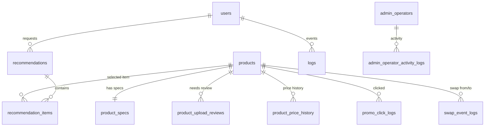

# 06. DB 설계 (ERD & 스키마)

**파일 경로:** `_docs/06_db-erd.md`  
**문서 버전:** Ver 2.0  
**DBMS:** PostgreSQL (DB명 `popcorn_pc`)  
**상품 기준:** `_docs/13_standard_product_csv.md`, `products_standard_v1.csv`, `product_specs_standard_v1.csv`

---

## 1. 설계 원칙

기존 `팝콘PC_상품_2026-06-10기준(통합).csv`는 레거시 참조본으로만 사용한다. 새 상품 DB는 운영자가 앞으로 업로드할 표준 CSV v1을 기준으로 한다.

기존 원본 CSV의 쇼핑몰/장부/공급처/비정형 카테고리 컬럼은 DB에 1:1 보존하지 않는다. 상품 운영과 AI 추천에 필요한 필드만 표준화해서 저장한다.

```text
레거시 통합 CSV
  └─ 표준화 스크립트
      ├─ products_standard_v1.csv
      ├─ product_specs_standard_v1.csv
      └─ product_upload_review_v1.csv

DB
  ├─ products
  ├─ product_specs
  └─ product_upload_reviews
```

---

## 2. ERD 개요



---

## 3. 상품 기본 테이블 — products

`products_standard_v1.csv`의 기준 테이블이다. 기존 상품 정보는 폐기 가능하며, 표준 CSV 재적재 시 `products`와 `product_specs`를 새로 구성한다.

| 컬럼명 | 타입 | CSV 필드 | 비고 |
|---|---|---|---|
| `product_code` | BIGINT PK | product_code | 팝콘PC 내부 상품코드 |
| `product_name` | VARCHAR(500) | product_name | 정제 상품명 |
| `maker` | VARCHAR(100) | maker | 제조사 |
| `brand` | VARCHAR(100) | brand | 브랜드 |
| `model_name` | VARCHAR(255) | model_name | 모델명 |
| `part_type` | VARCHAR(50) | part_type | 표준 부품 타입 |
| `category_group` | VARCHAR(50) | category_group | `core_part`, `peripheral`, `service`, `internal`, `unknown` |
| `status` | VARCHAR(20) | status | 판매중/품절/단종/삭제대기 |
| `ai_candidate_yn` | BOOLEAN | ai_candidate_yn | AI 추천 후보 여부 |
| `purchase_price` | BIGINT | purchase_price | 매입가 |
| `sale_price` | BIGINT | sale_price | 운영 판매가 |
| `market_price` | BIGINT | market_price | 시중가 |
| `supplier` | VARCHAR(200) | supplier | 공급처 |
| `warranty_months` | INTEGER | warranty_months | 보증기간 |
| `spec_source_text` | TEXT | spec_source_text | 원본 스펙 정제본 |
| `review_required_yn` | BOOLEAN | review_required_yn | 검수 필요 여부 |
| `review_reason` | TEXT | review_reason | 검수 사유 |
| `created_at` | TIMESTAMP | 자동 | 생성일 |
| `updated_at` | TIMESTAMP | 자동 | 수정일 |

---

## 4. 상품 스펙 테이블 — product_specs

`product_specs_standard_v1.csv` 기준 테이블이다. AI 추천과 호환성 검증에 필요한 필드만 저장한다.

| 컬럼명 | 타입 | 의미 |
|---|---|---|
| `product_code` | BIGINT PK/FK | products 참조 |
| `part_type` | VARCHAR(50) | 표준 부품 타입 |
| `socket` | VARCHAR(30) | CPU/메인보드 소켓 |
| `chipset` | VARCHAR(50) | 메인보드 칩셋 |
| `mem_type` | VARCHAR(10) | DDR4/DDR5 |
| `capacity_gb` | INTEGER | RAM/SSD/HDD 용량 |
| `clock_mhz` | INTEGER | 메모리 클럭 |
| `tdp_watt` | INTEGER | CPU/GPU 소비전력 |
| `rated_watt` | INTEGER | 파워 정격 출력 |
| `required_power_watt` | INTEGER | GPU 권장 파워 |
| `length_mm` | INTEGER | GPU 길이 |
| `gpu_max_mm` | INTEGER | 케이스 GPU 장착 가능 길이 |
| `cooler_height_mm` | INTEGER | 케이스 쿨러 한계 또는 공랭쿨러 높이 |
| `cooler_tdp` | INTEGER | 쿨러 대응 TDP |
| `pcie_gen` | VARCHAR(20) | PCIe 세대 |
| `form_factor` | VARCHAR(50) | ATX/M-ATX/Mini-ITX 등 |
| `interface` | VARCHAR(50) | NVMe/SATA 등 |
| `tag_white` | BOOLEAN | 화이트 감성 |
| `tag_rgb` | BOOLEAN | RGB/LED |
| `tag_silent` | BOOLEAN | 저소음 |
| `updated_at` | TIMESTAMP | 갱신일 |

---

## 5. 업로드 검수 테이블 — product_upload_reviews

표준 CSV 생성 또는 업로드 과정에서 운영자 검수가 필요한 행을 저장한다.

| 컬럼명 | 타입 | 의미 |
|---|---|---|
| `review_id` | BIGSERIAL PK | 검수 ID |
| `row_no` | INTEGER | CSV 행 번호 |
| `product_code` | BIGINT | 상품코드 |
| `product_name` | VARCHAR(500) | 상품명 |
| `error_type` | VARCHAR(50) | 오류/검수 유형 |
| `error_message` | TEXT | 상세 사유 |
| `raw_category1~3` | VARCHAR(100) | 레거시 원본 카테고리 참고값 |
| `raw_spec` | TEXT | 원본 스펙 참고값 |
| `review_status` | VARCHAR(30) | 대기/검수중/승인/수정/보류/제외 |
| `created_at` | TIMESTAMP | 생성일 |

---

## 6. 추천 후보 기준

AI 추천 후보 쿼리는 반드시 아래 조건을 사용한다.

```sql
SELECT p.*, ps.*
FROM products p
JOIN product_specs ps ON ps.product_code = p.product_code
WHERE p.status = '판매중'
  AND p.category_group = 'core_part'
  AND p.ai_candidate_yn = true
  AND p.review_required_yn = false
  AND p.part_type IN (
    'CPU',
    'GPU',
    'MB',
    'RAM',
    'SSD',
    'HDD',
    'POWER',
    'CASE',
    'COOLER_CPU_AIR',
    'COOLER_CPU_AIO'
  );
```

`MONITOR`, `KEYBOARD`, `MOUSE`, `SPEAKER` 등은 주변기기 추천 기능에서 별도 사용한다.

---

## 7. 사용자·추천·로그 테이블

상품 재설계 이후에도 아래 테이블은 유지한다.

| 테이블 | 목적 |
|---|---|
| `users` | 추천 서비스 사용자 최소 정보 |
| `logs` | 유저 저니, 프롬프트, AI 응답 로그 |
| `recommendations` | 추천 요청 헤더 |
| `recommendation_items` | 추천 세트별 부품 목록 |
| `policy_weights` | 재고/마진/가성비 추천 가중치 |
| `category_margin_policies` | 표준 부품 타입 또는 운영 카테고리 기준 마진 정책 |
| `product_price_history` | 상품 가격 변동 이력 |
| `api_cost_logs` | 3사 LLM 비용 로그 |
| `promo_click_logs` | 특가/추천 클릭 로그 |
| `swap_event_logs` | 부품 스왑/탈락 이벤트 |
| `rate_limit_policies` | 호출 제한 정책 |
| `cost_thresholds` | 비용 임계치와 서킷 브레이커 |
| `csv_import_jobs`, `csv_import_errors` | CSV 업로드 작업과 오류 |
| `admin_operators`, `admin_operator_activity_logs` | 운영자/권한/활동 로그 |

---

## 8. 인덱스

상품 조회와 추천 후보 조회를 위해 아래 인덱스를 유지한다.

```sql
CREATE INDEX idx_products_standard_filter
ON products (status, category_group, part_type, maker);

CREATE INDEX idx_products_ai_candidate
ON products (ai_candidate_yn, part_type)
WHERE ai_candidate_yn = true;

CREATE INDEX idx_products_name_trgm
ON products USING gin (product_name gin_trgm_ops);

CREATE INDEX idx_specs_parttype
ON product_specs (part_type);

CREATE INDEX idx_product_upload_reviews_status
ON product_upload_reviews (review_status, created_at DESC);
```

로그/추천/관리자 화면 인덱스는 기존 `001_create_popcorn_core_schema.sql`의 도메인별 인덱스를 유지한다.

---

## 9. 마이그레이션·시드 정책

상품 DB 표준화 이후 초기 구축 순서는 다음과 같다.

```bash
npm.cmd run standardize:products
npm.cmd run db:reset-products-standard-v1
```

관련 파일:

| 파일 | 목적 |
|---|---|
| `app/db/migrations/005_reset_products_standard_v1.sql` | 기존 상품 도메인 폐기 및 표준 상품 테이블 재구성 |
| `app/scripts/reset-products-standard-v1.js` | `app/db/standardized` CSV를 DB에 적재 |
| `app/db/standardized/products_standard_v1.csv` | 상품 기본 정보 |
| `app/db/standardized/product_specs_standard_v1.csv` | AI 연산 스펙 |
| `app/db/standardized/product_upload_review_v1.csv` | 운영자 검수 큐 |

기존 `db_products.csv`, `db_product_specs.csv`, 원본 통합 CSV 직접 적재 방식은 폐기한다.
